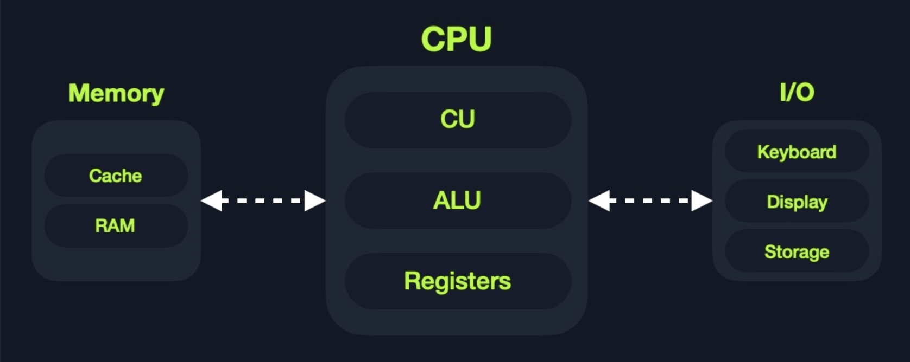
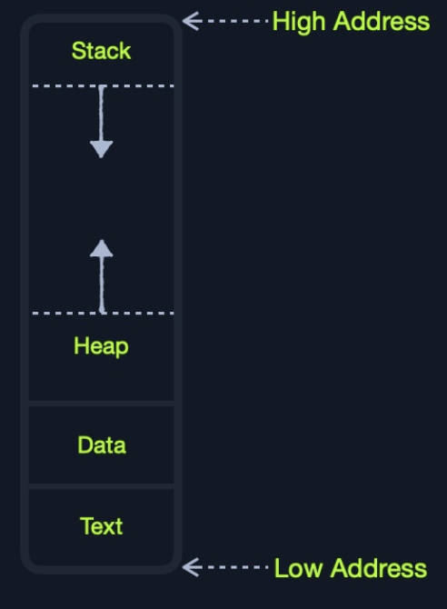
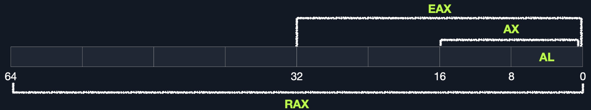

# 1. Computer Architecture

## 1.1 Memory

- Cache

- RAM:RAM is much larger than cache memory, coming in sizes ranging from gigabytes up to terabytes

  

  - Stack:Has a Last-in First-out (LIFO) design and is fixed in size. Data in it can only be accessed in a specific order by push-ing and pop-ing data
  - Heap:Has a hierarchical design and is therefore much larger and more versatile in storing data, as data can be stored and retrieved in any order. However, this makes the heap slower than the Stack.
  - Data:Has two parts: `Data`, which is used to hold variables, and `.bss`, which is used to hold unassigned variables (i.e., buffer memory for later allocation).
  - Text:Main assembly instructions are loaded into this segment to be fetched and executed by the CPU.

# 2. CPU Architecture

## 2.1 Clock Cycle

- Fetch:Takes the next instruction's address from the `Instruction Address Register` (IAR), which tells it where the next instruction is located.
- Decode: Takes the instruction from the IAR, and decodes it from binary to see what is required to be executed.
- Execute:Fetch instruction operands from register/memory, and process the instruction in the `ALU` or `CU`.
- store:Store the new value in the destination operand.

# 3. Registers, Addresses, and Data Types

## 3.1 Registers

- Data Registers:The primary data registers are: `rax`, `rbx`, `rcx`, and `rdx`. The `rdi` and `rsi` registers also exist and are usually used for the instruction `destination` and `source` operands. Then, we have secondary data registers that can be used when all previous registers are in use, which are `r8`, `r9`, and `r10`.

- Pointer Registers:The main pointer registers are the Base Stack Pointer `rbp`, which points to the beginning of the Stack, the Current Stack Pointer `rsp`, which points to the current location within the Stack (top of the Stack), and the Instruction Pointer `rip`, which holds the address of the next instruction.

  | **Data Registers** | **Pointer Registers** |
  | ------------------ | --------------------- |
  | `rax`              | `rbp`                 |
  | `rbx`              | `rsp`                 |
  | `rcx`              | `rip`                 |
  | `rdx`              |                       |
  | `r8`               |                       |
  | `r9`               |                       |
  | `r10`              |                       |

### Sub-Registers

| Description                     | 64-bit Register | 32-bit Register | 16-bit Register | 8-bit Register |
| ------------------------------- | --------------- | --------------- | --------------- | -------------- |
| **Data/Arguments Registers**    |                 |                 |                 |                |
| Syscall Number/Return value     | `rax`           | `eax`           | `ax`            | `al`           |
| Callee Saved                    | `rbx`           | `ebx`           | `bx`            | `bl`           |
| 1st arg - Destination operand   | `rdi`           | `edi`           | `di`            | `dil`          |
| 2nd arg - Source operand        | `rsi`           | `esi`           | `si`            | `sil`          |
| 3rd arg                         | `rdx`           | `edx`           | `dx`            | `dl`           |
| 4th arg - Loop counter          | `rcx`           | `ecx`           | `cx`            | `cl`           |
| 5th arg                         | `r8`            | `r8d`           | `r8w`           | `r8b`          |
| 6th arg                         | `r9`            | `r9d`           | `r9w`           | `r9b`          |
| **Pointer Registers**           |                 |                 |                 |                |
| Base Stack Pointer              | `rbp`           | `ebp`           | `bp`            | `bpl`          |
| Current/Top Stack Pointer       | `rsp`           | `esp`           | `sp`            | `spl`          |
| Instruction Pointer 'call only' | `rip`           | `eip`           | `ip`            | `ipl`          |

## 3.2 Memory Address

| Addressing Mode | Description                                                  | Example                         |
| --------------- | ------------------------------------------------------------ | ------------------------------- |
| `Immediate`     | The value is given within the instruction                    | `add 2`                         |
| `Register`      | The register name that holds the value is given in the instruction | `add rax`                       |
| `Direct`        | The direct full address is given in the instruction          | `call 0xffffffffaa8a25ff`       |
| `Indirect`      | A reference pointer is given in the instruction              | `call 0x44d000` or `call [rax]` |
| `Stack`         | Address is on top of the stack                               | `add rsp`                       |

### Address Endim

| **Address**       | **0** | **1** | **2** | **3** | **4** | **5** | **6** | **7** | **Address Value**  |
| ----------------- | ----- | ----- | ----- | ----- | ----- | ----- | ----- | ----- | ------------------ |
| **Little Endian** | 77    | 66    | 55    | 44    | 33    | 22    | 11    | 00    | 0x0011223344556677 |
| **Big Endian**    | 00    | 11    | 22    | 33    | 44    | 55    | 66    | 77    | 0x0011223344556677 |

`The important thing we need to take from this is knowing that our bytes are stored into memory from right-to-left.` So, if we were to push an address or a string with Assembly, we would have to push it in reverse. For example, if we want to store the word `Hello`, we would push its bytes in reverse: `o`, `l`, `l`, `e`, and finally `H`.

## 3.3 Data Types

| Component             | Length            | Example              |
| --------------------- | ----------------- | -------------------- |
| `byte`                | 8 bits            | `0xab`               |
| `word`                | 16 bits - 2 bytes | `0xabcd`             |
| `double word (dword)` | 32 bits - 4 bytes | `0xabcdef12`         |
| `quad word (qword)`   | 64 bits - 8 bytes | `0xabcdef1234567890` |

**`Whenever we use a variable with a certain data type or use a data type with an instruction, both operands should be of the same size.`**

| Sub-register | Data Type |
| ------------ | --------- |
| `al`         | `byte`    |
| `ax`         | `word`    |
| `eax`        | `dword`   |
| `rax`        | `qword`   |