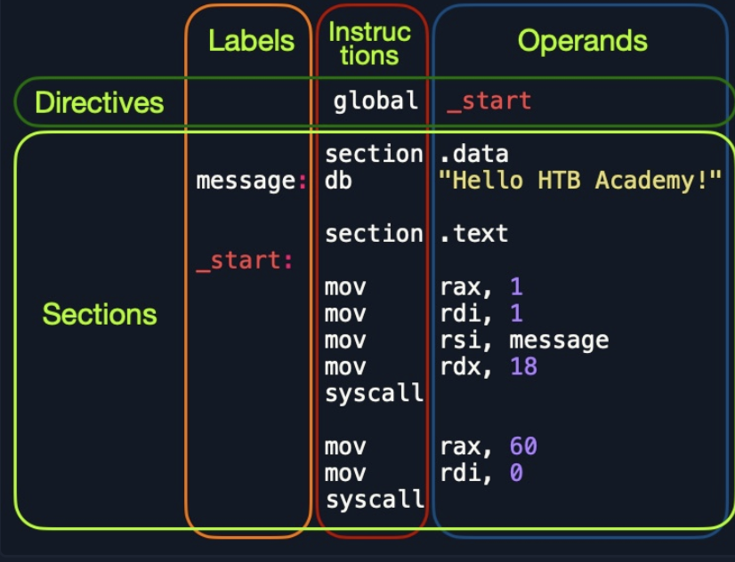
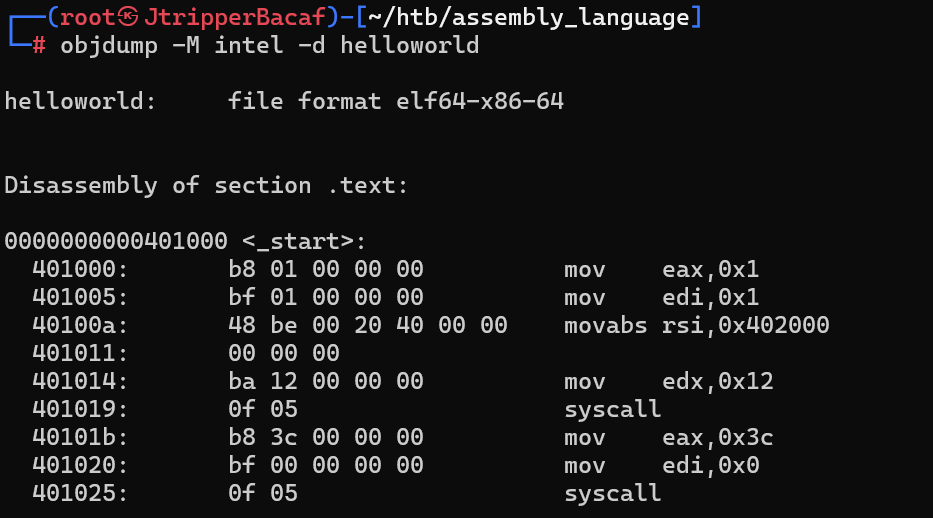

# 1.Assmebly File Structure

```assembly
         global  _start

         section .data
message: db      "Hello HTB Academy!"

         section .text
_start:
         mov     rax, 1
         mov     rdi, 1
         mov     rsi, message
         mov     rdx, 18
         syscall

         mov     rax, 60
         mov     rdi, 0
         syscall
```



| Section         | Description                                                  |
| --------------- | ------------------------------------------------------------ |
| `global _start` | This is a `directive` that directs the code to start executing at the `_start` label defined below. |
| `section .data` | This is the `data` section, which should contain all of the variables. |
| `section .text` | This is the `text` section containing all of the code to be executed. |

Both the `.data` and `.text` sections refer to the `data` and `text` memory segments, in which these instructions will be stored.

We can define variables using `db` for a list of bytes, `dw` for a list of words, `dd` for a list of digits, and so on

```assembly
section .data
    message db "Hello World!", 0x0a
    length  equ $-message
```

`$` represent the current address and message represent the beginning of message. And `equ` means equal.This op calc the length of message(Through offset) and store in the variable `length`.

`global  _start` define the beginning of code. And code will be executed at the `_start` label

# 2. Assembly and disassembly

## 2.1 Assembling

- assemble our code with `nasm`

  - edit a file named `helloworld.s`

    ```bash
    nasm -f elf64 $filename
    ```

- link it using `ld`

  ```assembly
  ld -o helloWorld helloWorld.o
  ```

## 2.2 Disassembly

```bash
objdump -M intel -d $filename 
```



`message` is replaced by `0x402000`


To dump any strings, we can use the `-s` flag, and add `-j .data` to only examine the `.data` section

```bash
objdump -sj .data $filename
```


