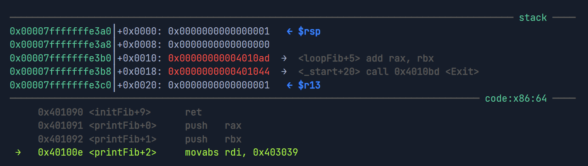

# 1.Stack

The top of the stack is referred to by the Top Stack Pointer `rsp`, while the bottom is referred to by the Base Stack Pointer `rbp`.


| **Instruction** | **Description**                                              | **Example** |
| --------------- | ------------------------------------------------------------ | ----------- |
| `push`          | Copies the specified register/address to the top of the stack | `push rax`  |
| `pop`           | Moves the item at the top of the stack to the specified register/address | `pop rax`   |

- `Push`: [rsp]=rax; rsp=rsp-4
- `pop`:rax=rsp;rsp=rsp+4

# 2.Syscall

Get syscall number:`cat /usr/include/x86_64-linux-gnu/asm/unistd_64.h`

Note: With `32-bit` x86 processors, the syscall numbers are in the `unistd_32.h` file.

## 2.1 General syscall

### write

> man 2 write
>
> ssize_t write(int fd, const void buf[.count], size_t count);
>
> - fd:File Descriptor fd to be printed to (usually 1 for stdout)
> - buf:write content
> - count:size of buf

Now that we understand how to locate various syscall and their arguments let's start learning how to call them. To call a syscall, we have to:

1. Save registers to stack

2. Set its syscall number in `rax`

   ```assembly
   mov rax, $syscallnumber
   ```

3. Set its arguments in the registers

   | Description                 | 64-bit Register | 8-bit Register |
   | --------------------------- | --------------- | -------------- |
   | Syscall Number/Return value | `rax`           | `al`           |
   | Callee Saved                | `rbx`           | `bl`           |
   | 1st arg                     | `rdi`           | `dil`          |
   | 2nd arg                     | `rsi`           | `sil`          |
   | 3rd arg                     | `rdx`           | `dl`           |
   | 4th arg                     | `rcx`           | `cl`           |
   | 5th arg                     | `r8`            | `r8b`          |
   | 6th arg                     | `r9`            | `r9b`          |

   As we can see, we have a register for each of the first `6` arguments. Any additional arguments can be stored in the stack (though not many syscalls use more than `6` arguments.).

   **Note: `rax` is also used for storing the `return value` of a syscall or a function. So, if we were expecting to get a value back from a syscall/function, it will be in `rax`.**

4. Use the syscall assembly instruction to call it

> Eg:we want to print "Fibonacci Sequence:" to the screen
>
> ```assembly
> global _start
> 
> section .data
>     message db "Fibonacii Sequence:"
>     lenth equ $-message
> 
> section .text
> _start:
>     mov rax,1   ;set the syscall
>     mov rdi,1   ;set stdout
>     mov rsi,message ;set print content
>     mov rdx,lenth  ; set the count
>     syscall
>     mov rax,60
>     mov rdi,0
>     syscall
> ```

# 3 Procedures

A `procedure` (sometimes referred to as a `subroutine`) is usually a set of instructions we want to execute at specific points in the program. So instead of reusing the same code, we define it under a procedure label and `call` it whenever we need to use it.

## 3.1 defining procedures

> eg:
>
> ```assembly
> global  _start
> 
> section .data
>     message db "Fibonacci Sequence:", 0x0a
> 
> section .text
> _start:
> 
> printMessage:
>     mov rax, 1       ; rax: syscall number 1
>     mov rdi, 1      ; rdi: fd 1 for stdout
>     mov rsi,message ; rsi: pointer to message
>     mov rdx, 20      ; rdx: print length of 20 bytes
>     syscall         ; call write syscall to the intro message
> 
> initFib:
>     xor rax, rax    ; initialize rax to 0
>     xor rbx, rbx    ; initialize rbx to 0
>     inc rbx         ; increment rbx to 1
> 
> loopFib:
>     add rax, rbx    ; get the next number
>     xchg rax, rbx   ; swap values
>     cmp rbx, 10		; do rbx - 10
>     js loopFib		; jump if result is <0
> 
> Exit:
>     mov rax, 60
>     mov rdi, 0
>     syscall
> ```

## 3.2 `call` and `ret`

When we want to start executing a procedure, we can `call` it, and it will go through its instructions. The `call` instruction pushes (i.e., saves) the next instruction pointer `rip` to the stack and then jumps to the specified procedure.

Once the procedure is executed, we should end it with a `ret` instruction to return to the point we were at before jumping to the procedure. The `ret` instruction `pops` the address at the top of the stack into `rip`, so the program's next instruction is restored to what it was before jumping to the procedure.

`call procedure1`:

```assembly
push rip
jmp procedure1 
```

`ret`:

```assembly
pop rip 
jmp rip
```

# 4 functions

Functions are a form of `procedures`. However, functions tend to be more complex and should be expected to use the stack and all registers fully. So, we can't simply call a function as we did with procedures. Instead, functions have a `Calling Convention` to properly set up before being called.

There are four main things we need to consider before calling a function:

1. `Save Registers` on the stack (`Caller Saved`)
2. Pass `Function Arguments` (like syscalls)
3. Fix `Stack Alignment`
4. Get Function's `Return Value` (in `rax`)

All of the above points are from a `caller` point of view, as we call a function. When it comes to writing a function, there are different points to consider, which are:

1. Saving `Callee Saved` registers (`rbx` and `rbp`)
2. Get arguments from registers
3. Align the Stack
4. Return value in `rax`

## 4.1 Using External Functions

We will try to print `Fibonacci Sequence` without syscall,instead using `printf` in `labc`

1. Importing libc Functions

   ```assembly
   global  _start
   extern  printf
   ```

2. Saving Registers

   In this step,we should save value in the registers in the stack and pop it after call

   ```assembly
   printFib:
       push rax        ; push registers to stack
       push rbx
       ; function call
       pop rbx         ; restore registers from stack
       pop rax
       ret
   ```

3. Function Arguments

   In this process,we need to figure out the function arguments and push the arguments in the stack.

   ```c
   int printf(const char *restrict format, ...);
   ```

   So,we'd like to get our argue like this 

   ```c
   printf("%d\n",number)
   ```

   ```assembly
   section .data
       message db "Fibonacci Sequence:", 0x0a
       outFormat db  "%d", 0x0a, 0x00
   printFib:
       push rax            ; push registers to stack
       push rbx
       mov rdi, outFormat  ; set 1st argument (Print Format)
       mov rsi, rbx        ; set 2nd argument (Fib Number)
       pop rbx             ; restore registers from stack
       pop rax
       ret
   ```

4. Stack Alignment

   ***THIS IS CONSTRICT BY C FUNCTION,AND PRINT DON"T NEED***

   Whenever we want to make a `call` to a function, we must ensure that the `Top Stack Pointer (rsp)` is aligned by the `16-byte` boundary from the `_start` function stack.

   This means that we have to push at least 16-bytes (or a multiple of 16-bytes) to the stack before making a call to ensure functions have enough stack space to execute correctly. This requirement is mainly there for processor performance efficiency. Some functions (like in `libc`) are programed to crash if this boundary is not fixed to ensure performance efficiency. If we assemble our code and break right after the second `push`, this is what we will see:

   

   We see that we have four 8-bytes pushed to the stack, making a total boundary of 32-bytes. This is due to two things:

   1. Each procedure `call` adds an 8-byte address to the stack, which is then removed with `ret`
   2. Each `push` adds 8-bytes to the stack as well

   So, we are inside `printFib` and inside `loopFib`, and have pushed `rax` and `rbx`, for a total of a 32-byte boundary. Since the boundary is a multiple of 16, `our stack is already aligned, and we don't have to fix anything.`

   However,if we do not use any argument and just call the function like this:

   ```assembly
   _start:
       mov rbx,2
       mov rax,1
       xor rax,rax
       call function
       # other op
   ```

   We may notice that rsp is just 8 byte from `_start` function stack. we need to  modify it  like this :

   ```assembly
   _start:
       mov rbx, 2
       mov rax, 1
       xor rax, rax
       sub rsp, 8        # modify the stack align
       call function     # push the return address
       add rsp, 8        # recover the stack
   ```

5. Dynamic linker

   As we use printf,so we should dynamic link the `/lib64/ld-linux-x86-64.so.2` when we `ld`

   ```bash
   ld fib.o -o fib -lc --dynamic-linker /lib64/ld-linux-x86-64.so.2
   ```

   

# 5. Libc function

So far,we can print Fib seq with static number,we want to input number and will use scanf

Same as printf use

```C
int scanf(const char *restrict format, ...);
```

```
scanf("%d",&input)
```

set a mem to store input

```assembly
section .data
    message db "Please input max Fn", 0x0a
    outFormat db  "%d", 0x0a, 0x00
    inFormat db  "%d", 0x00
section .bss
     userInput resb 4   # 4 byte to store int
```

```assembly
mov rdi,inFormat
mov rsi,userInput
sub rsp,8
call scanf
add rsp,8
```

Without this,we can use `read` to read from `stdin` and `write` to write to `stdout`

```assembly
global _start
section .data
    message db "Please input a number"
    len1 equ $-message
    message2 db "Your input is",0x0a,0x00
    len2 equ $-message2
section .bss
     userInput resb 4
section .text
_start:
    mov rax,1               ;print the message1
    mov rdi,1
    mov rsi,message
    mov rdx,len1
    syscall
    
    mov rax,0          ;read  
    mov rdi,0          ;stdin
    mov rsi,userInput
    mov rdx,4
    syscall
    
    mov rax,1
    mov rdi,1
    mov rsi,message2
    mov rdx,len2
    syscall
    
    mov rax,1
    mov rdi,1
    mov rsi,userInput
    mov rdx,4
    syscall
    
    mov rax,60
    mov rdi,0
    syscall
    
```


