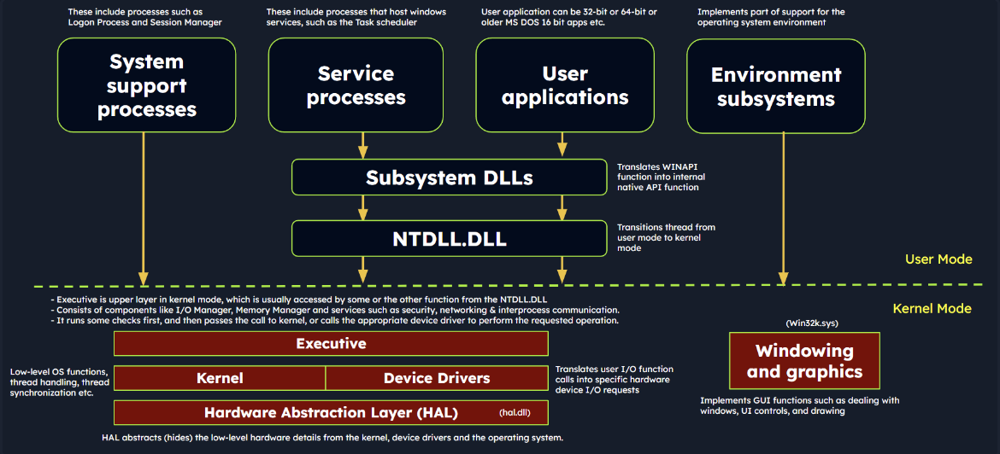
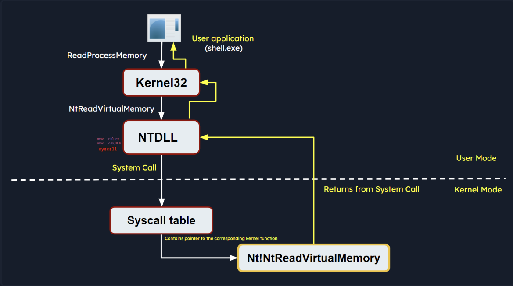
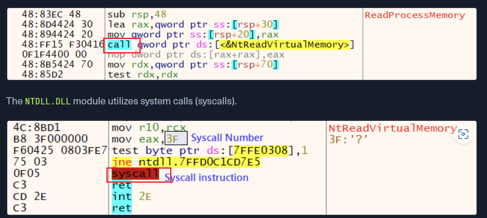
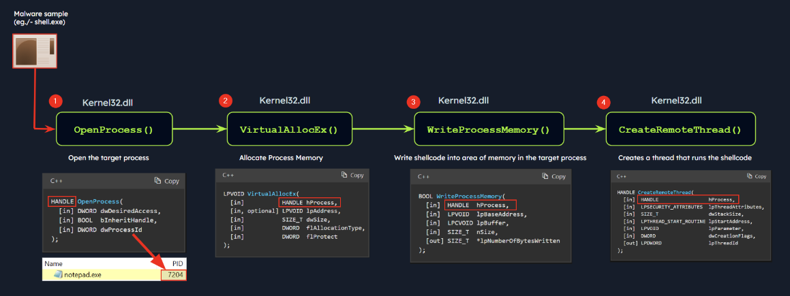
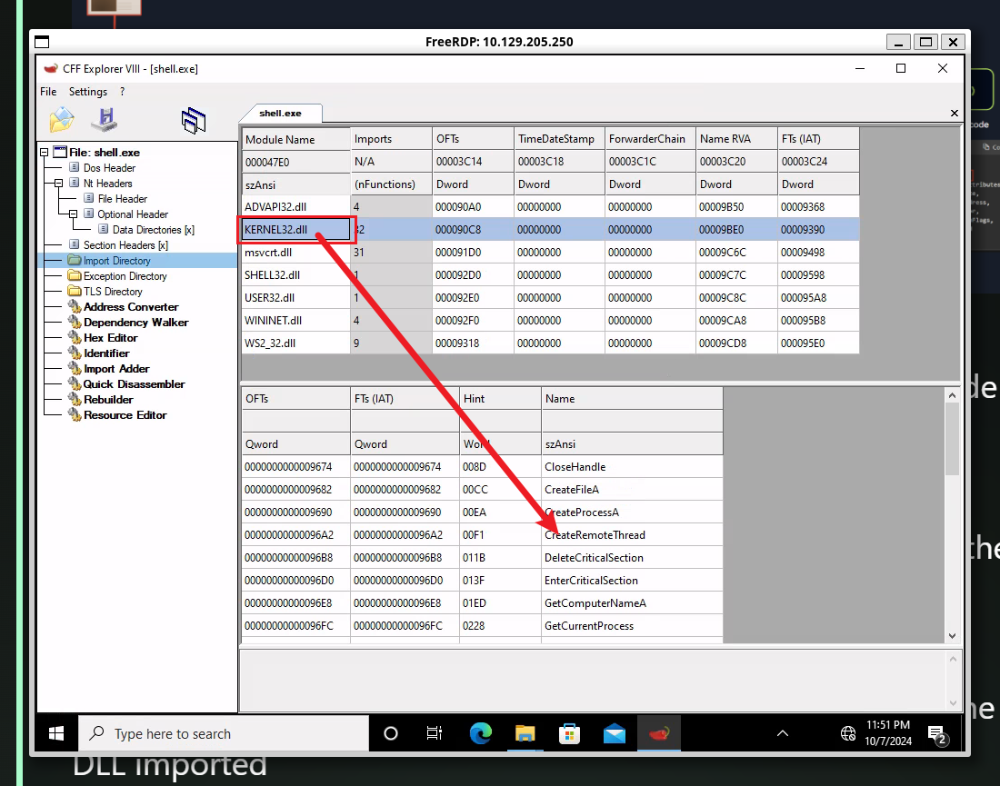

window provide 2 different types of mode:

- user mode: most application and user processes operate.
  - limit access to system
  - interact with OS via APIs
  - processes isolated from each other
  - `**malware can still manipulate files, registry settings, network connections, and other user-accessible resources, and it may attempt to escalate privileges to gain more control over the system.**`
- kernel mode: highly privileged mode
  - unrestricted access to system,hardware and critical function
  - provide core services
  - Divice drivers run in here
  - `malware operates in kernel mode, it gains elevated control and can manipulate system behavior, conceal its presence, intercept system calls, and tamper with security mechanisms.`

# 1. Windows Architecture



User mode Components:

- `System Support Processes`:provide curcial functionalities and services such as logon processes(`winlogon.exe`),Session Manager (`smss.exe`), and Service Control Manager (`services.exe`). 
- `Service Prrocesses`:`Windows update service`,`Task Scheduler`,`print Spooler`.These service always run background.
- `User Applications`:created by users,Interact with OS APIs.These API calls get redirected to `NTDLL.DLL`,triggering a transition from user mode to kernel mode.
- `Environment subsystems`:provide execution enviroment,including `Win32 Subsystem`,`POSIX` and `OS/2`
- Subsystem DLLs:dynamic-link lib translate doc functions into internal system calls.(`kernelbase.dll`,`user32.dll`,`wininet.dll`,`advapi32.dll`)

Kernel mode components:

- `Executive`:gets accessed via functions from NTDLL.DLL.It consists of `I/O manager`,`Object Manager`,`Security Reference Monitor`,`Process manager`.It runs some checks first,and then pass the call to kernel or calls the device driver to perform.
- `Kernel`:manages system resources,provide low-level services like `thread scheduling`,`interrupt and exception dispatching` and `multiprocessor synchronization`
- `Device Drivers`:enable the OS interact with hardware devices
- `Hardware Abstraction Layer`:provide an abstraction layer between the hardware and OS.
- `windowing and graphics system(win32k.sys)`:managing the GUI

# 2. Windows API call flow

Malware often utilize Windows API calls to interact with the system and carry out malicious operations. By understanding the internal details of API functions, their parameters, and expected behavior, analysts can identify suspicious or unauthorized API usage.

> Eg: Let's consider an example of a Windows API call flow, where a user-mode application tries to access privileged operations and system resources using the [ReadProcessMemory function](https://learn.microsoft.com/en-us/windows/win32/api/memoryapi/nf-memoryapi-readprocessmemory). This function allows a process to read the memory of a different process.
>
> 
>
> ```c
> BOOL ReadProcessMemory(
>   [in]  HANDLE  hProcess,
>   [in]  LPCVOID lpBaseAddress,
>   [out] LPVOID  lpBuffer,
>   [in]  SIZE_T  nSize,
>   [out] SIZE_T  *lpNumberOfBytesRead
> );
> ```
>
> `ReadProcessMemory` belongs to `kernel32.dll`mand the call is invoked via `kernel32.dll` and interacts with `NTDLL.DLL`.
>
> 
>
> The `syscall` trigger the system call using the parameters set previously.It transfer the user mode into kernel mode.
>
> If the request is authorized, the thread is transitioned from user mode into the kernel mode. The kernel maintains a table known as the `System Service Descriptor Table (SSDT)` or the `syscall table (System Call Table)`, which is a data structure that contains pointers to the various system service routines. These routines are responsible for handling system calls made by user-mode applications. Each entry in the syscall table corresponds to a specific system call number, and the associated pointer points to the corresponding kernel function that implements the requested operation.
>
> The syscall responsible for `ReadProcessMemory` is executed in the kernel, where the Windows memory management and process isolation mechanisms are leveraged. The kernel performs necessary validations, access checks, and memory operations to read the memory from the target process. The kernel retrieves the physical memory pages corresponding to the requested virtual addresses and copies the data into the provided buffer.
>
> Once the kernel has finished reading the memory, it transitions the thread back to user mode and control is handed back to the original user mode application. The application can then access the data that was read from the target process's memory and continue its execution.

# 3.Portable Executable

Windows employ `Portable Executable(PE)` to encapsulate executable programs,DLL...

PE Sections:

- `Text Section(.text)`:executable code resides
- `Data Section(.data)`:storage for initialized global and static data variables
- `Read-only initialized data(.rdata)`:read-only data such as constant values,string literals and initialized global and static variables.(const)
- `Exception information(.pdata)`:A collection of function table entries utilized for exception handling.
- `BSS Section(.bss)`:Holds uninitialized global and static data variables.
- `Resource Section(.rsrc)`:Safeguards resources such as images,icons,strings,and version information.
- `Import Section(.idata)`:Details about functions imported from other DLLs.
- `Export Section(.edata)`:Information about functions exported by the executable.
- `Relocation Section(.reloc)`:Details for relocating the executable's code and data when loaded at a different memory address.

We can use  `pestudio` to see the sections of PE

# 4. Processes

Each process is characterized by:

- `PID`:a id assigned to each process within the OS
- `Virtual Address Space(VAS)`:In windows, every process is allocated its own virtual address space.The VAS is sectioned into segments, including code, data, and stack segments, allowing the process isolated memory access.
- `Executable Code(Image file on disk)`:the binary executable file stored on the disk.
- `Table of Handles to System Objects`:a table of handles, a reference catalogue for various system objects.
- `Security Context(Access Token)`:Each process has a security context,embodied by an `Access token`.This `Access Token` encapsulates information about the process's security privileges, including the user account under which the process operates and the access rights granted to the process.
- `Threads Running in its Context`

# 5.Dynamic-link library(DLL)

A Dynamic-link library(DLL) is a type of PE.`DLLs expose an array of functions which can be exploited by malware`

## 5.1 Import Functions

- Import functions are function that a binary dynamically links to from external libraries or modules during runtime.
- During malware analysis,examining import functions may shed light on the external lib or module that malware is dependent on.
- By identifying specific functions imported,it becomes possible to ascertain the actions of the malware.
- Import function name or hashes can serves as IOCs(Indicators of Compromise) that assist in identifying malware.

> Eg:
>
> 
>
> The the above example,the malware managed to inject the code into a target process(notepad.exe).
>
> As a result,the injected code is executed within the context of the target process by the newly created remote thread.
>
> we can analysis the shell.exe with `CFF Explorer` to figure out he DLL imported
>
> 

## 5.2 Export Funtions

- Export funtions are the functions that a binary exposes for use by other modules or applications
- These functions provide an interface for other software to interact with the binary.


