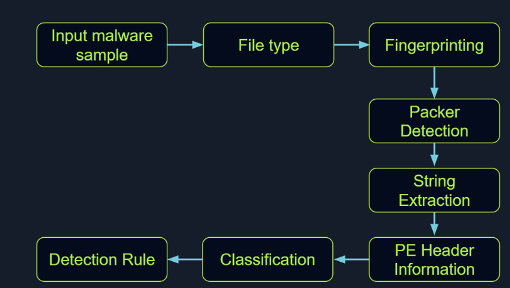
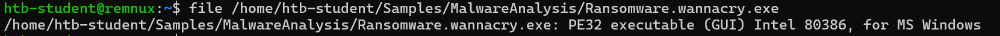
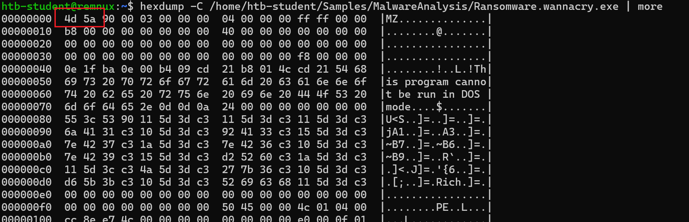
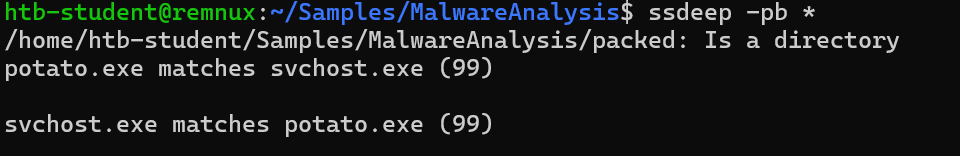

Through static analysis,we endeavor to extract pivotal information which includes:

- file type
- file hash
- String
- Embedded elements
- Packer information
- Imports
- Exports
- Assembly code



# 1. Identifying the file type

```bash
file $filename
```



```bash
hexdump -C $filename | more
```



`4d 5a`represent the executable file.

# 2.Malware Fingerprinting

In this stage,our mission is to create a unique identifier for the malware(md5,SHA1,SHA256)

Purposes

- Identification and tracking malware
- Scanning system for the presence of identical malware
- Confirmation of previous encounters and analyses of the same malware

```bash
md5sum $filename
Sha256sum $filename
```

# 3.File Hash lookup

Using hash we extract previously,we can check the hash online(virustotal etc.)

Although file hash is valuable,it is falls short when identifying similar malware.So we use:

## 3.1 Import Hashing(Imphash)

A hash calculated from the import functions of a PE file.ts algorithm functions by first converting all imported function names to lowercase. Following this, the DLL names and function names are fused together and arranged in alphabetical order. Finally, an MD5 hash is generated from the resulting string. Therefore, two PE files with identical import functions, in the same sequence, will share an `IMPHASH` value.

We can use `pefile` module in Python to do this:

```python
import sys
import pefile
import peutils

pe_file = sys.argv[1]
pe = pefile.PE(pe_file)
imphash = pe.get_imphash()

print(imphash)
```

## 3.2 Fuzzy Hashing(SSDEEP)

`Fuzzy Hashing (SSDEEP)`, also referred to as context-triggered piecewise hashing (CTPH), is a hashing technique designed to compute a hash value indicative of content similarity between two files. This technique dissects a file into smaller, fixed-size blocks and calculates a hash for each block. The resulting hash values are then consolidated to generate the final fuzzy hash.

The `SSDEEP` algorithm allocates more weight to longer sequences of common blocks, making it highly effective in identifying files that have undergone minor modifications, or are similar but not identical, such as different variations of a malicious sample.

```bash
SSDEEP $filename
```

```bash
ssdeep -pb $file #-p denotes Pretty matching mode, and -b is used to display only the file names, sans the full path.
```

can compare the exe file in the directory and match the similarity.

> 
>
> on the eg above shows 99% similarity between potato.exe and svchost.exe

## 3.3 Section Hashing(Hashing PE Sections)

`Section hashing` works by calc hash of each sections.This can help identify similar malware samples.

```python
import sys
import pefile
pe_file = sys.argv[1]
pe = pefile.PE(pe_file)
for section in pe.sections:
    print (section.Name, "MD5 hash:", section.get_hash_md5())
    print (section.Name, "SHA256 hash:", section.get_hash_sha256())
```

This kind of tech is not foolproof.Malware authors might employ tactics like section name obfuscation or dynamically generating section names to bypass this kind of analysis.

# 4. String Analysis

String can furnish clues and valuable insight into the functionality such as：

- Embedded filenames(eg:dropped files)
- IP address or domain names
- Registry path or keys
- Windows API functions
- command-line arguments
- Unique informations about author

```bash
strings -n $num $filename
```

This command print a sequence of at least the $num specified string.

It should be noted that another string analysis solution exists called `FLOSS`. `FLOSS`, short for "FireEye Labs Obfuscated String Solver", is a tool developed by FireEye's FLARE team to automatically deobfuscate strings in malware. It's designed to supplement the use of traditional string tools, like the strings command in Unix-based systems, which can miss obfuscated strings that are commonly used by malware to evade detection.

```bash
floss $filename
```


# 5. Unpacking UPX-packed Malware

In our static analysis, we might stumble upon a malware sample that's been compressed or obfuscated using a technique referred to as packing. Packing serves several purposes:

- It obfuscates the code, making it more challenging to discern its structure or functionality.
- It reduces the size of the executable, making it quicker to transfer or less conspicuous.
- It confounds security researchers by hindering traditional reverse engineering attempts.

A popular packer used in many malware variants is the `Ultimate Packer for Executables (UPX)`.

```bash
upx -d -o $output $input
```


